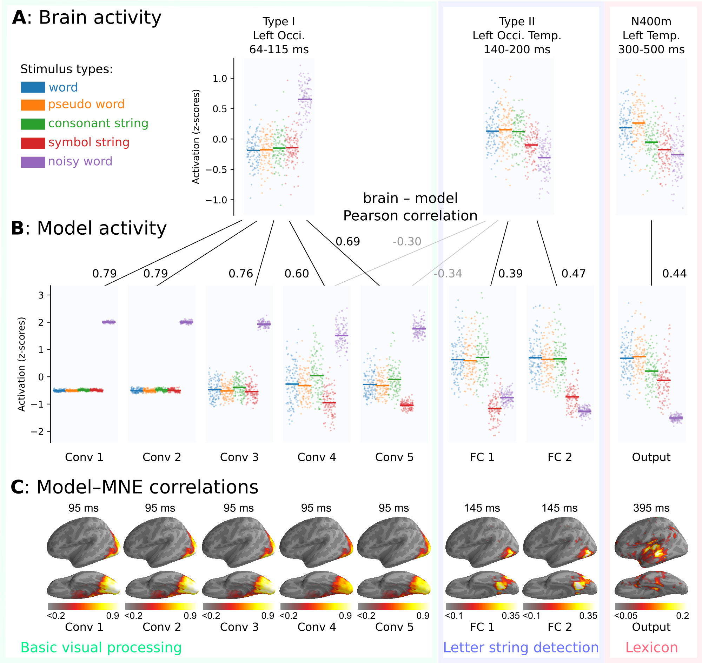

# A baseline deep learning model of visual word recognition

This repository contains the model and code to recreate the figures in:

Marijn van Vliet, Oona Rinkinen, Takao Shimizu, Anni-Mari Niskanen, Barry Devereux and Riitta Salmelin (2023), "Convolutional networks can model the functional modulation of MEG responses during reading", preprint.




## Installing model, data and python dependencies

The model is implemented in PyTorch and the architecture (`VGG11Stochastic`) is defined in `network.py`. The `train_net.py` script can be used to train it.

The data (including suitable training sets for the model) is stored on OSF: https://osf.io/nu2ep/ (14.8 GB)
By default, the scripts assume the data is placed in a subfolder called `data/`, but each script has a `data_path` variable declared at the top that can be set to another path.

The Python code to generate the figures depends on a number of packages listed in `requirements.txt`. One way to install them is through pip:

```bash
pip install -r requirements.txt
```


## Generating the training datasets

Pre-build training datasets are included in the data that can be downloaded from OSF (https://osf.io/nu2ep).
However, if you wish to build them from scratch, the scripts in `training_datasets/` can be used.
Since these scripts render a million images, the core image generation routine is implemented in [Rust](https://www.rust-lang.org/) instead of Python for extra speed.
There is a Windows version (`render_stimulus.dll`) and Ubuntu Linux version (`render_stimulus.so`) of the compiled Rust code, but if you need to compile for a different platform, you can do:

```bash
cd training_datasets/render_stimulus
cargo build --release
cp target/release/librender_stimulus.so ../render_stimulus.so
```

With the Rust code compiled, the main image generation script can be run to generate the various training sets used in the paper.

```bash
python training_datasets/construct_words.py --vocab=250 --add-words=./include_words.txt data/training_datasets/250words train
python training_datasets/construct_words.py --vocab=250 --add-words=./include_words.txt data/training_datasets/250words test
python training_datasets/construct_words.py --vocab=1000 --add-words=./include_words.txt data/training_datasets/1kwords train
python training_datasets/construct_words.py --vocab=1000 --add-words=./include_words.txt data/training_datasets/1kwords test
python training_datasets/construct_words.py --vocab=10000 --add-words=./include_words.txt data/training_datasets/10kwords train
python training_datasets/construct_words.py --vocab=10000 --add-words=./include_words.txt data/training_datasets/10kwords test
python training_datasets/construct_words.py --vocab=10000 --freq --add-words=./include_words.txt data/training_datasets/10kwords-freq train
python training_datasets/construct_words.py --vocab=10000 --freq --add-words=./include_words.txt data/training_datasets/10kwords-freq test
```


## Training the model

The network architecture of all the models are defined in `networks.py`.
The `VGG11Stochastic` architecture is that of the final model.
A pre-trained version of the models is included in the OSF data (final model: `models/vgg11stochastic_first_imagenet_then_10kwords-freq.pth.tar`).
However, if you want to train a model from scratch, the `train_net.py` script can be used to do it.
The ImageNet pre-trained version of the model must be used in this case.
For example, to train the final model:

```bash
python train_net.py --arch vgg11stochastic --resume data/models/vgg11stochastic_imagenet.pth.tar data/training_datasets/10kwords-freq
```

The training script will generate a `checkpoint.pth.tar` file after each epoch and a `best_model.pth.tar` file that contains the overall best performing model.


## Generating the figures

The following scripts can be run to reproduce the figures in the paper, and some of the computations:

```
model_layer_activity.py               - Run the stimuli through the model and get the mean activation of each layer
plot_dipole_timecourses.py            - Plot the grand-average signal timecourses of each ECD group.
plot_model_brain_correlation.py       - Plot the comparison between ECD groups and layers in the final model.
plot_model_brain_correlations.py      - Plot the comparison between ECD groups and layers in several models.
compute_model_brain_comparison_mne.py - Correlate the activity within each layer with the distributed MNE source estimate
```
